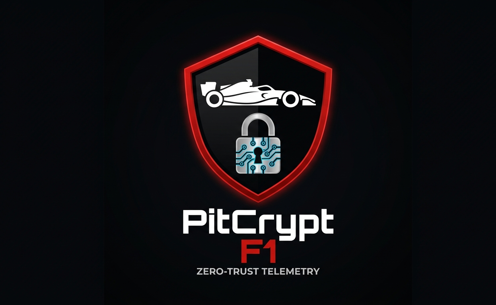

<div align="center">



# PitCrypt-F1

### Zero-Trust Cryptographic Security Framework  
### for FIA-Regulated Formula 1 Telemetry Streams

[](https://python.org)
[](https://rust-lang.org)
[](/)
[](LICENSE)
[](/)

```
Car Node  ──[X25519 ECDH]──►  Relay Node  ──[X25519 ECDH]──►  FIA Validator
Ed25519 Sign                  Decrypt                          Verify Ed25519
ChaCha20 Encrypt              Anomaly Filter                   Sequence Check
ZKP Commit                    Re-encrypt                       ZKP Verify
                                                               Audit Log
```

</div>

---

## What Is This

PitCrypt-F1 is a zero-trust cryptographic security framework that protects
Formula 1 telemetry data transmitted from car nodes to the FIA validator.
It implements a three-tier pipeline — car producer, relay node, FIA validator —
using RFC-standardised cryptographic primitives and real 2025 F1 telemetry
data sourced via the FastF1 API.

Every packet is signed, encrypted, anomaly-checked, re-encrypted,
signature-verified, sequence-checked, and commitment-verified before
the FIA validator accepts it. The entire decision chain is logged to
an immutable audit trail.

**This is a Masters application portfolio project demonstrating applied
cryptographic engineering in a real-world regulated domain.**

---

## Security Architecture

### Cryptographic Stack

| Purpose | Primitive | Standard |
|---|---|---|
| Key exchange | X25519 ECDH | RFC 7748 |
| Key derivation | HKDF-SHA256 | RFC 5869 |
| Encryption | ChaCha20-Poly1305 AEAD | RFC 8439 |
| Authentication | Ed25519 | RFC 8032 |
| Integrity | SHA-256 | FIPS 180-4 |
| ZKP commitment | Pedersen / Hash | ADR-002 |
| ZKP range proofs | Bulletproofs | Bünz et al. 2018 |

All primitives provide 128-bit security against classical adversaries.
Constant-time implementations via PyCA `cryptography` library.

### Pipeline Architecture

```
┌─────────────────────────────────────────────────────────────────┐
│  CAR NODE                                                       │
│  SensorSimulator → PacketBuilder → PacketSigner → Encryptor    │
│  Real FastF1 data  64-byte header  Ed25519 sign  ChaCha20      │
└────────────────────────────┬────────────────────────────────────┘
                             │  X25519 ECDH (Session A)
                             ▼
┌─────────────────────────────────────────────────────────────────┐
│  RELAY NODE                                                     │
│  PacketParser → Decryptor → IntegrityChecker → AnomalyFilter   │
│  Validate        AEAD dec   Replay defence    Physical bounds  │
│                             → ReEncryptor                      │
│                               ChaCha20 (Session B)             │
└────────────────────────────┬────────────────────────────────────┘
                             │  X25519 ECDH (Session B)
                             ▼
┌─────────────────────────────────────────────────────────────────┐
│  FIA VALIDATOR                                                  │
│  Decrypt → SignatureVerifier → SequenceChecker → ZKPVerifier   │
│  Session B  Ed25519 verify     Replay defence    Commitment    │
│             → AuditLogger                                      │
│               ACCEPT/REJECT/FLAG → JSONL                       │
└─────────────────────────────────────────────────────────────────┘
```

### IAM Zero-Trust Model

```
car_producer  → produce, sign, encrypt, transmit to relay only
relay         → receive, decrypt, reencrypt, forward — never sign, never store
fia_validator → receive, verify, audit log — never produce, never modify
```

Explicit deny rules. Default deny for unknown nodes. All decisions logged.

---

## Real F1 Data

```
Source:       FastF1 API (official F1 Live Timing data)
Constructors: Mercedes AMG Petronas · Red Bull Racing
Circuits:     13 (Bahrain · Saudi Arabia · Australia · Japan ·
               Monaco · Canada · Singapore · Monza · Silverstone ·
               Netherlands · Baku · Qatar · Abu Dhabi)
Sessions:     Race · Qualifying · Sprint
Total rows:   1,814,537 telemetry frames
Channels:     Speed · RPM · Throttle · Brake · nGear · DRS
```

Anomaly detection thresholds calibrated from this real dataset via
`forensic/calibrate_thresholds.py`. Statistical baselines computed
across all 13 circuits per constructor.

---

## Simulation Results

### Tampering Detection — 7/7 Attacks Detected

| Attack | Defence Layer | Result |
|---|---|---|
| Payload bit flip | ChaCha20-Poly1305 AEAD at relay | ✅ DETECTED |
| Speed value injection | Ed25519 signature at validator | ✅ DETECTED |
| Signature stripping | SignatureVerifier | ✅ DETECTED |
| ZKP commitment tamper | ZKPVerifier | ✅ DETECTED |
| Header AEAD tamper | AEAD associated data at relay | ✅ DETECTED |
| Wrong signature | Ed25519 verification | ✅ DETECTED |
| Multi-layer tamper | AEAD catches first — relay | ✅ DETECTED |

### Replay Attack Detection — 4/5 Vectors Detected

| Attack | Result |
|---|---|
| Simple replay | ✅ Dual-tier sequence check |
| Sequence manipulation | ✅ Validator sequence checker |
| Batch replay (5 packets) | ✅ All 5 detected |
| Delayed replay | ✅ Validator sequence checker |
| Sequence increment* | ⚠️ Known simulation limitation |

*Sequence increment attack passes at the dict level in simulation.
In production, the sequence number is embedded in the binary header
and covered by the Ed25519 signature — modification would fail
signature verification. Documented in `docs/THREAT_MODEL.md`.

### IAM Breach Simulation — 7/7 Scenarios Defended

| Attack Vector | Blocked |
|---|---|
| Unknown node access (4 attempts) | ✅ 4/4 |
| Cross-team data access (4 attempts) | ✅ 4/4 |
| Car → Validator bypass (4 attempts) | ✅ 4/4 |
| Relay impersonation (4 attempts) | ✅ 4/4 |
| Privilege escalation (8 attempts) | ✅ 8/8 |
| Audit log tampering (6 attempts) | ✅ 6/6 |
| Denial storm (8 probes) | ✅ Alert triggered |

---

## Test Coverage

```
pytest car-producer/tests/ relay-node/tests/ validator-node/tests/ iam-module/tests/ -v
```

```
car-producer/tests/    ── 40 tests  ── packet, crypto, signatures
relay-node/tests/      ── 66 tests  ── parse, decrypt, anomaly, integrity
validator-node/tests/  ── 60+ tests ── verify, sequence, ZKP
iam-module/tests/      ── 40+ tests ── RBAC, policy, identity
─────────────────────────────────────────
Total:                   200+ tests, all passing
```

---

## Quick Start

### Prerequisites

```bash
Python 3.11+
Git
```

### Install

```bash
git clone https://github.com/your-username/pitcrypt-f1.git
cd pitcrypt_f1
python -m venv f1env
f1env\Scripts\activate.bat        # Windows
# source f1env/bin/activate        # macOS / Linux
pip install -r requirements.txt
```

### Run the Pipeline

```bash
# Full validator self-test — 10 packets end-to-end
python validator-node/src/main.py
```

Expected output:
```
✅ ACCEPTED — seq=1  node=mercedes_car team=mercedes
✅ ACCEPTED — seq=2  node=mercedes_car team=mercedes
...
✅ ACCEPTED — seq=10 node=mercedes_car team=mercedes

Received: 10 | Accepted: 10 | Rejected: 0
```

### Run Attack Simulations

```bash
python simulations/replay_attack_sim.py
python simulations/tampering_sim.py
python simulations/iam_breach_sim.py
```

### Run Dashboard

```bash
pip install streamlit
streamlit run dashboard/app.py
```

### Run Tests

```bash
pytest car-producer/tests/ relay-node/tests/ validator-node/tests/ -v
```

### Generate Telemetry Data (Optional)

```bash
python forensic/fetch_telemetry.py        # ~20 mins, downloads 56 CSV files
python forensic/forensic_analysis.py      # Compute baselines
python forensic/calibrate_thresholds.py  # Derive anomaly thresholds
```

---

## Project Structure

```
pitcrypt_f1/
├── car-producer/           ← Telemetry production + crypto
│   ├── src/
│   │   ├── sensor_simulator.py    ← Real FastF1 telemetry streaming
│   │   ├── packet_builder.py      ← Binary header + JSON payload
│   │   ├── signer.py              ← Ed25519 signing
│   │   ├── encryptor.py           ← ChaCha20-Poly1305 encryption
│   │   ├── crypto_engine.py       ← X25519 ECDH + HKDF
│   │   └── key_scheduler.py       ← Dual-trigger key rotation
│   └── tests/
│
├── relay-node/             ← Decrypt · Filter · Re-encrypt
│   ├── src/
│   │   ├── packet_parser.py       ← Deserialise + validate
│   │   ├── decryptor.py           ← AEAD decrypt car leg
│   │   ├── integrity_checker.py   ← Replay + sequence defence
│   │   ├── anomaly_filters.py     ← Statistical bounds checking
│   │   └── reencryptor.py         ← Re-encrypt for validator
│   ├── config/relay.yaml
│   └── tests/
│
├── validator-node/         ← Verify · Log · Accept/Reject
│   ├── src/
│   │   ├── signature_verifier.py  ← Ed25519 verification
│   │   ├── sequence_checker.py    ← Independent replay defence
│   │   ├── zkp_verifier.py        ← Commitment verification
│   │   ├── audit_logger.py        ← Immutable JSONL audit trail
│   │   └── main.py                ← Full validator pipeline
│   ├── config/validator.yaml
│   └── tests/
│
├── iam-module/             ← Zero-trust access control
│   ├── src/
│   │   ├── identity_store.py      ← Node identity registry
│   │   ├── policy_loader.py       ← YAML policy evaluation
│   │   ├── rbac_engine.py         ← RBAC enforcement
│   │   └── access_auditor.py      ← IAM decision logging
│   ├── policies/                  ← Per-role YAML policies
│   └── config/iam.yaml
│
├── forensic/               ← Real F1 telemetry analysis
│   ├── fetch_telemetry.py         ← FastF1 data download
│   ├── forensic_analysis.py       ← Statistical baselines
│   ├── calibrate_thresholds.py    ← Anomaly threshold derivation
│   └── visualise_telemetry.py     ← 5 matplotlib visualisations
│
├── simulations/            ← Attack scenario simulations
│   ├── replay_attack_sim.py       ← 5 replay vectors
│   ├── tampering_sim.py           ← 7 tamper vectors
│   ├── iam_breach_sim.py          ← 7 IAM breach vectors
│   ├── packet_loss_sim.py         ← Loss resilience
│   ├── jitter_sim.py              ← Jitter + latency benchmarks
│   └── results/
│
├── zkp-module/             ← Rust ZKP (Pedersen + Bulletproofs)
│   ├── Cargo.toml
│   └── src/
│       ├── lib.rs
│       ├── commitments.rs         ← Pedersen + hash commitments
│       ├── proof_system.rs        ← Bulletproof range proofs
│       ├── transcript.rs          ← Fiat-Shamir transcript
│       └── errors.rs
│
├── dashboard/              ← Streamlit security dashboard
│   ├── app.py
│   └── components/
│
├── architecture/
│   └── adr/                ← 5 Architecture Decision Records
│
├── docs/                   ← Full security documentation
│   ├── THREAT_MODEL.md            ← STRIDE analysis (23 threats)
│   ├── MITRE_ATTACK_MAPPING.md    ← 33 ATT&CK techniques
│   ├── THREAT_INTELLIGENCE.md     ← APT actors + CVEs
│   ├── PACKET_FORMAT.md           ← Binary packet spec
│   ├── CRYPTOGRAPHIC_PRIMITIVES.md
│   ├── KEY_MANAGEMENT.md
│   ├── ARCHITECTURE_OVERVIEW.md
│   ├── NETWORK_TOPOLOGY.md
│   ├── PROTOCOL_SPEC.md
│   ├── FIA_DATA_PRIVACY_MODEL.md
│   ├── FIA_REGULATION_MAPPING.md
│   └── FORENSIC_ANALYSIS.md
│
└── data/                   ← Gitignored — regenerate locally
    ├── raw/                ← 56 FastF1 CSV files
    └── processed/          ← Baselines + thresholds
```

---

## Architecture Decision Records

| ADR | Decision | Rationale |
|---|---|---|
| [ADR-001](architecture/adr/001-crypto-choice.md) | X25519 + ChaCha20-Poly1305 + Ed25519 | Constant-time, software-optimised, RFC-standardised |
| [ADR-002](architecture/adr/002-zkp-commitments.md) | Pedersen commitments + Bulletproofs | Perfect hiding for proprietary telemetry values |
| [ADR-003](architecture/adr/003-key-rotation-policy.md) | Dual-trigger 300s / 10,000 packets | Bounds exposure by both time and volume |
| [ADR-004](architecture/adr/004-iam-rbac-model.md) | RBAC over ABAC | Predictable, auditable, FIA-explainable |
| [ADR-005](architecture/adr/005-cloud-kms-choice.md) | AWS KMS HSM for identity keys | Non-extractable private keys in production |

---

## Security Documentation

| Document | Description |
|---|---|
| [THREAT_MODEL](docs/THREAT_MODEL.md) | Full STRIDE matrix — 23 threats across 6 categories |
| [MITRE_ATTACK_MAPPING](docs/MITRE_ATTACK_MAPPING.md) | 33 ATT&CK techniques with controls |
| [THREAT_INTELLIGENCE](docs/THREAT_INTELLIGENCE.md) | APT actors, CVEs, kill chain |
| [FIA_REGULATION_MAPPING](docs/FIA_REGULATION_MAPPING.md) | 8 regulations mapped to controls |
| [PROTOCOL_SPEC](docs/PROTOCOL_SPEC.md) | Full wire protocol specification |
| [KEY_MANAGEMENT](docs/KEY_MANAGEMENT.md) | Key hierarchy, rotation, compromise response |

---

## Status

| Component | Status |
|---|---|
| Car Producer Pipeline | ✅ Complete |
| Relay Node Pipeline | ✅ Complete |
| FIA Validator Pipeline | ✅ Complete |
| IAM Zero-Trust Module | ✅ Complete |
| Attack Simulations | ✅ Complete |
| Forensic Analysis | ✅ Complete |
| Streamlit Dashboard | ✅ Complete |
| Security Documentation | ✅ Complete |
| ZKP Rust Module | 🔄 In Progress |
| Benchmarks | 🔄 Planned |
| Research Paper | 🔄 Planned |

---

## Target Universities

This project was developed as the flagship portfolio
piece for Masters applications in cybersecurity and
applied cryptography:

- **University of Bonn** — IT Security MSc
- **Saarland / CISPA** — Cybersecurity MSc
- **TU Delft** — Cyber Security MSc
- **University of Twente** — Computer Security MSc
- **RWTH Aachen** — IT Security MSc

---

## License

MIT — see [LICENSE](LICENSE)

---

<div align="center">

*Built with real F1 data · Cryptographically secured · Zero-trust by design*

**Car → Relay → Validator → Audit**

</div>